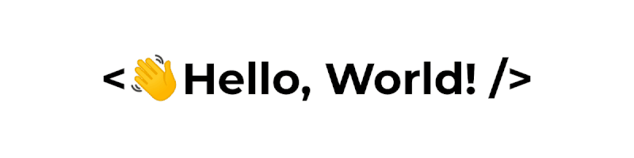
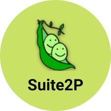
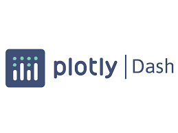

<!--
**aditiaravind/aditiaravind** is a ✨ _special_ ✨ repository because its `README.md` (this file) appears on your GitHub profile.

Here are some ideas to get you started:

- 🔭 I’m currently working on ...
- 🌱 I’m currently learning ...
- 👯 I’m looking to collaborate on ...
- 🤔 I’m looking for help with ...
- 💬 Ask me about ...
- 📫 How to reach me: ...
- 😄 Pronouns: ...
- ⚡ Fun fact: ...
-->

<!-- Social icons section 
<h1 align="center"> My Social Media: </h1>
  

    
    
  

</h1>

 -->

<!-- Description about me -->
<h2 align="center">  About me  </h2>

Hey there!  
I am <b>Aditi Aravind</b> from <strong>Chennai, India</strong> 
I have a masters from ETH Zurich and a bachelors from VIT, Vellore, both in <b> Biomedical Engineering </b>  
I am passionate about <b> Neuroscience, Human-Computer Interfaces and Data Science </b>  
Contact me for collaborations, I'd love to work on cool projects and make new friends!   

<!-- -->

    
    
  

  
- 🔭 &nbsp; I’m currently working on **Investigating Divergent Visual Perception in Autism Mouse Models**
- 🤝 &nbsp; I’m looking to collaborate on Open Source Projects and Brain Data Challenges
- 🤔 &nbsp; I’m looking for help with **Efficient algorithm for calculating Mutual Information as an Association Matrix**
- 💬 &nbsp; Ask me about **Fourier Transforms** (if you never want me to stop talking)
- 🎾 &nbsp; In my free time, I love playing Squash

  
 
<!-- GitHub stats section 

## Github stats

   
  
  
   

-->

   
<h1 align="center"> Languages/Frameworks I'm good at: </h1>

<code></code>
  <code></code>
  <code></code>
  <code></code>
  <code></code>
  <code></code>
  <code></code>
  <code></code>

 
<h1 align="center"> Environments I work with: </h1>

  <code></code>
  <code></code>
  <code></code>
  <code></code>

 

 

<h1 align="center"> My Certifications and courses: </h1>

  <ul>
  <li>Animal Handling Certification (Institute of Laboratory Animal Sciences, UZH, 10/2021) : ‘Introductory course in laboratory animal science for persons conducting animal experiments Species: Mice and Rats’</li>
  <li>'Sequence alignment & Mutation analysis' by BioNEST laboratory at VIT (2021)</li>
  <li>'Improving Deep Neural Networks: Hyperparameter tuning, Regularization and Optimization' on Coursera (2020)</li>
  <li>'Introduction to TensorFlow for Artificial Intelligence, Machine Learning, and Deep Learning' on Coursera (2020)</li>
  <li>'Neural Networks and Deep Learning' on Coursera (2020)</li>
  <li>'Data Science' by Internshala (2020)</li>
  <li>'Machine Learning' by Internshala (2020)</li>
  <li>'Hands-on Training in Biomedical Applications' at Harvey Biomedical Pvt (2018)</li>
  <li>'International Short Course on Biomechanics' by SSN College of Engineering (2018)</li>
  </ul>
  

 
